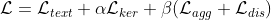
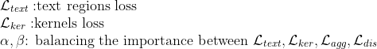

# Scanned-Text-Receipt-Text-Localization

## Data
- This project was aimed to localize texts with 4 vertices which was task 1 of [ICDAR-SROIE 2019](https://rrc.cvc.uab.es/?ch=13&com=introduction)
- The dataset was also provided by ICDAR-SROIE with 626 images for training phase and 361 images for testing phase.
	- [GoogleDrive](https://drive.google.com/open?id=1ShItNWXyiY1tFDM5W02bceHuJjyeeJl2)
	- [Baidu](https://pan.baidu.com/s/1a57eKCSq8SV8Njz8-jO4Ww#list/path=%2FSROIE2019&parentPath=%2F)
	- The format annotation of each image is:
	```
	x1_1,y1_1,x2_1,y2_1,x3_1,y3_1,x4_1,y4_1,transcript_1
	x1_2,y1_2,x2_2,y2_2,x3_2,y3_2,x4_2,y4_2,transcript_2
	x1_3,y1_3,x2_3,y2_3,x3_3,y3_3,x4_3,y4_3,transcript_3
	...
	```
	- An example of image:
		

## Evaluation
The challenge used hmean score to rank model's performance which is: 


## PAN model

- For the purpose of ICDAR-SROIE Task 1, we can apply `the achor-based text detectiors` which is object detectors or `the anchor-free text detectors` which is text segmentation. In this project, I chose the second method by applying **[Efficient and Accurate Arbitrary-Shaped Text Detection with Pixel Aggregation Network](https://arxiv.org/abs/1908.05900)** or **PAN** in short.

- According to PAN's author, there are two main challenges still exist in scene text detection:
	- first: the trade-off between speed and accuracy 
	- second: the model can detect the arbitrary-shaped text instance

- Recently, some methods have been proposed to tackle arbitrary-shaped text detection, but they rarely take the speed of the entire pipeline into consideration, which may fall short in practical applications. PAN is equipped with a `low computational-cost segmentation head` and a `learnable post-processing`.
	

### PAN pipeline


### PAN architecture


- For high efficiency, the backbone of the segmentation network must be lightweight: resnet18 is used for lightweight backbone
- But the features offered by a lightweight backbone often have small receptive fields and weak representation capabilities. Therefore PAN model proposed the segmentation-head which includes 2 modules:
	- Feature Pyramid Enhancement Module (FPEM)
	- Feature Fusion Module (FFM)


#### Pixel Aggregation (PA)

- In the post-processing phase, there are 2 ideas:
	- Distance between text pixel and kernel in the same text instance must be small enough in order to assign the text pixels to the right kernel. To achieve this, PAN used Loss aggregation: 
	- The other idea is that the distance between kernels must be far enough. To achive this, PAN used Loss discriminate: 		

### PAN's Loss function





## Result:

By only applying the PAN model for task 1, the result got [5th place in the context of SROIE](https://rrc.cvc.uab.es/?ch=13&com=evaluation&task=1):


- **One of the worst result got hmean = 0.6567**

- **One of the best result with hmean = 1**
